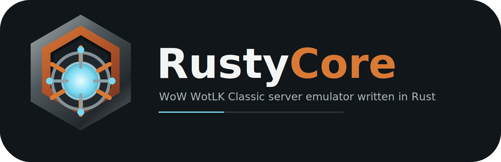

# RustyCore

<p align="center">
  
</p>

**WoW Wrath of the Lich King Classic (3.4.3.54261) server emulator written in Rust.**

[](https://www.gnu.org/licenses/gpl-3.0)
[](https://www.rust-lang.org)
[](#)
[](https://discord.gg/mH6ACpGPb2)

RustyCore is currently in the middle of a full C++ -> Rust port of a TrinityCore-style WotLK Classic server.

The goal is behavioral parity with the legacy C++ implementation first, and Rust-native cleanup only when the original behavior is understood. This is not a greenfield emulator that guesses the rules from scratch: packet formats, database behavior, world state, gameplay gates, and runtime order must be checked against the C++ source before being treated as correct.

The project is usable for parts of the login/world-entry path and contains a large amount of represented server logic, but the full gameplay runtime is still under active migration.

## Target

RustyCore currently targets:

- **Client:** WotLK Classic `3.4.3.54261`
- **Tested game build:** `51943`
- **World DB expectation:** `TDB 343.24081`, `cache_id = 24081`
- **Reference implementation:** TrinityCore/WotLK-style C++ source
- **Main development branch:** `develop`
- **Stable checkpoint branch:** `main`, fast-forwarded from `develop`

Modern client systems that are not part of the WotLK gameplay target, such as Battle Pets and Black Market, can exist in notes or partial code because the source tree has modern-era surface area. They are parked for future-version work and are not current WotLK migration priorities.

## Current Status

RustyCore has many C++-contrasted systems represented in Rust, plus prior smoke testing for login, realm selection, character enumeration, and initial world entry.

The important distinction is:

- **Represented logic** means Rust code models a C++ behavior with tests and explicit boundaries.
- **Live runtime parity** means that behavior is wired into the actual server loop, map ownership, packet fanout, database lifecycle, visibility, and client-visible runtime.

Represented logic is useful, but it is not the same thing as a complete running server. The remaining high-value work is mostly around live runtime convergence: maps, movement, combat, visibility/fanout, respawns, scripts, and the exact order of C++ world/map updates.

Current state is tracked in:

- [docs/migration/honest-progress-audit.md](docs/migration/honest-progress-audit.md)
- [docs/migration/current-session-handoff.md](docs/migration/current-session-handoff.md)
- [docs/MIGRATION_ROADMAP.md](docs/MIGRATION_ROADMAP.md)
- [docs/migration/adr-runtime-tick-ownership.md](docs/migration/adr-runtime-tick-ownership.md)

Older summaries and checklist percentages can drift. For port work, the C++ source and current Rust code are the authority.

## Architecture Snapshot

The runtime is intentionally in a transition state while the port moves from session-owned behavior toward map-owned behavior.

- `bnet-server` handles Battle.net auth, REST glue, TLS RPC, realm discovery, and login-related DB work.
- `world-server` owns world startup, DB/store loading, realm and instance listeners, session creation, and map-loop orchestration.
- `wow-world` contains `WorldSession`, packet handlers, represented player/gameplay logic, and the legacy shared map manager.
- `wow-map` contains the canonical map-runtime direction: map update loop, map-owned objects, grids, respawns, and long-term world ownership.
- `wow-packet` owns packet read/write types and wire-shape tests.
- `wow-database` owns SQLx database access and prepared statement definitions.
- `wow-data` owns DBC/DB2-style data loading and typed stores.

The current runtime split is:

1. The legacy `wow_world::MapManager` is shared between sessions and still owns several represented creature/session behaviors.
2. The canonical `wow_map::MapManager` has the global map tick direction and C++-like map structures.
3. Migration work is moving tick ownership, creature updates, respawns, movement, visibility, and fanout into the correct map/global runtime without double-updating state.

That split is a migration bridge, not the final design.

## Tech Stack

- **Rust 1.85+** — edition 2024
- **Tokio** — async runtime and networking
- **Axum** — Battle.net REST API
- **SQLx + MariaDB** — login/auth, characters, world, and hotfix databases
- **hecs** — ECS experiments and entity storage work
- **prost** — protobuf support for Battle.net protocol messages
- **tracing** — structured logging
- **zlib/miniz_oxide** — packet and account-data compression helpers

## Workspace Layout

```text
crates/
  bnet-server/       Battle.net authentication server
  world-server/      World/game server entry point
  wow-core/          Core types, GUIDs, time, networking helpers
  wow-constants/     Opcodes and game constants
  wow-crypto/        SRP6, AES-GCM and auth crypto
  wow-network/       Tokio sockets, session manager, registries
  wow-packet/        Packet serialization/deserialization
  wow-handler/       Packet handler metadata and dispatch support
  wow-world/         WorldSession, handlers, represented game logic
  wow-map/           Canonical map and runtime structures
  wow-data/          DBC/DB2 data loading and stores
  wow-database/      SQLx database layer and prepared statements
  wow-ai/            Creature AI work
  wow-chat/          Chat validation and routing helpers
  wow-loot/          Loot logic
  wow-script/        Script integration foundation
  wow-scripts/       Script crate experiments
  wow-anticheat/     Anticheat support
  wow-logging/       Logging helpers
```

Important documentation:

```text
docs/migration/      Port notes, inventories, audits, roadmap
docs/operations/     Runtime and DB operation notes
CLAUDE.md            Agent/developer operating guide for this repo
MIGRATION_STATUS.md  Older high-level migration status
```

## Requirements

- Rust `1.85+`
- MariaDB `10.6+`
- `protoc` for protobuf-dependent crates; set `PROTOC` if it is not available on `PATH`
- A WotLK Classic `3.4.3.54261` client for manual testing
- Imported Trinity/TDB-style databases
- Extracted game data under the configured `DataDir` (`dbc`, `db2`, `maps`, `vmaps`, `mmaps` depending on the test)

## Build

```bash
cargo build --workspace
cargo test --workspace
```

For protobuf-dependent checks:

```bash
PROTOC=/path/to/protoc cargo check -p world-server
```

Release build:

```bash
cargo build -p bnet-server -p world-server --release
```

## Configuration

RustyCore reads Trinity-style config names where possible:

```text
worldserver.conf
worldserver.conf.d/
bnetserver.conf
bnetserver.conf.d/
```

Useful default ports:

| Service | Default |
|---|---:|
| Battle.net RPC TLS | `1119` |
| Battle.net REST | `8081` |
| World socket | `8085` |
| Instance socket | `8086` |

The active realm row in `auth.realmlist` must match the Rust worldserver listener and the client build. For the tested client path, the game build is `51943`.

Operational DB/bootstrap details are in:

- [docs/operations/db-bootstrap.md](docs/operations/db-bootstrap.md)

## Running

Recommended order:

```bash
cargo build -p bnet-server -p world-server --release
./target/release/bnet-server
./target/release/world-server
```

Expected startup evidence includes:

- DB target logs for login, character, world, and hotfix databases
- world DB version check for `TDB 343.24081` / `cache_id=24081`
- world listener on `8085`
- instance listener on `8086`
- realm marked online

If a C++ server is running on the same machine, stop it first and verify the ports are free before starting RustyCore.

## Smoke Testing

Login/realm/initial enter-world smoke testing is the first runtime gate. It does not prove gameplay parity, but it catches broken auth, realm config, character enum, and initial world entry.

There is a separate client-emulation smoke bot used during development. Its setup is documented in that bot repository; this README only describes the expected server-side path.

Minimum smoke-test path:

- Battle.net auth succeeds
- world auth succeeds
- character enum succeeds
- player login reaches `SMSG_LOGIN_VERIFY_WORLD`
- world log shows the login sequence completing

Manual client testing should only be claimed when it has actually been run for that slice.

## Testing During Development

Common focused commands:

```bash
cargo fmt --all --check
cargo test -p wow-packet account_data --lib
cargo test -p wow-world dispatch_metadata_matches_cpp_for_registered_active_opcodes --lib
PROTOC=/path/to/protoc cargo check -p world-server
git diff --check
```

Inventory TSV files are part of the migration state. Keep their column counts valid:

```bash
awk -F '\t' 'NF != 9 { print FNR ":" NF ":" $0; bad=1 } END { exit bad }' docs/migration/inventory/r8-entities-miniphase.tsv
awk -F '\t' 'NF != 11 { print FNR ":" NF ":" $0; bad=1 } END { exit bad }' docs/migration/inventory/r3-opcodes-registry.tsv
awk -F '\t' 'NF != 16 { print FNR ":" NF ":" $0; bad=1 } END { exit bad }' docs/migration/inventory/cpp-client-handlers.tsv
```

## Porting Method

Every meaningful gameplay change should follow this shape:

1. Pick a documented gap.
2. Find the exact C++ source references.
3. Compare current Rust behavior against C++ before editing.
4. Implement the smallest faithful slice.
5. Add focused positive and negative tests.
6. Update migration docs and inventories.
7. Run checks.
8. Commit the slice on `develop`.
9. Push `develop`.
10. Fast-forward `main` only at stable checkpoints.

Do not bulk-close rows. Do not mark a runtime feature complete just because a packet parser exists. Do not trust existing Rust code just because it compiles.

If C++ appears to have a bug, document the finding. Sometimes Rust should preserve legacy behavior for compatibility; sometimes a bug can be fixed deliberately. Either way, the decision should be explicit.

## Support The Project

RustyCore takes time: protocol research, C++ archaeology, Rust porting, DB work, packet tests, client testing, and long debugging sessions.

Donations are welcome if you want to support the time needed to keep the project moving.

| Network | Wallet |
|---|---|
| BTC | `bc1qeggjcl5guwmqr0aa4emufyzyh7nu5rkfrytqy8` |
| ETH / BNB | `0xfec63e014e0bd36d77b094ff27f7e7f5d7ab67aa` |
| Solana | `9ktt1zinmwwsZXGx9x1BM995FwbAfdNWe65v1mdPgDhn` |
| XRP | `rBVvKPrQAmd5uDZ89nDgz5HbSWVD6sTbg2` |

## License

RustyCore is licensed under GPL v3. See [LICENSE](LICENSE).

WoW protocol research and server behavior are based on the public work of the TrinityCore and MaNGOS communities.

World of Warcraft is owned by Blizzard Entertainment. This project is not affiliated with, endorsed by, or sponsored by Blizzard Entertainment.
